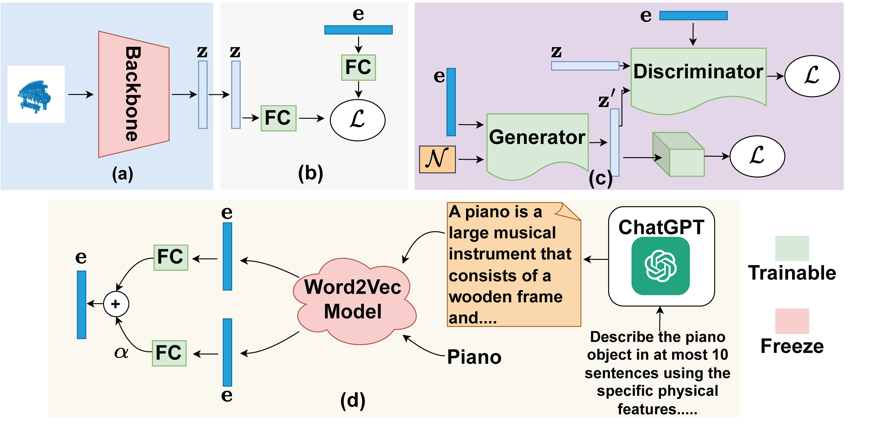
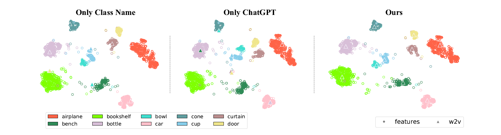
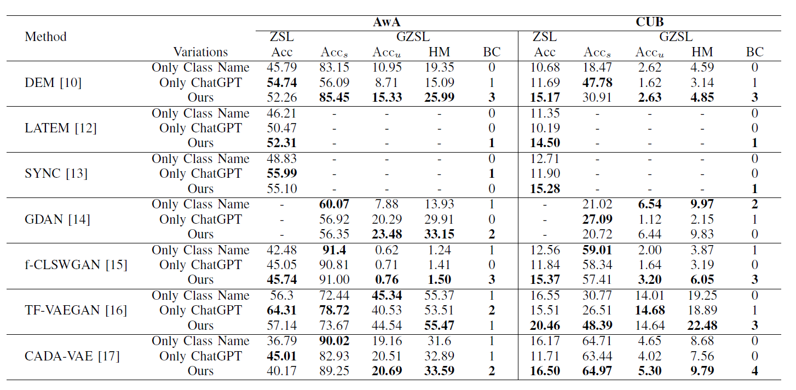
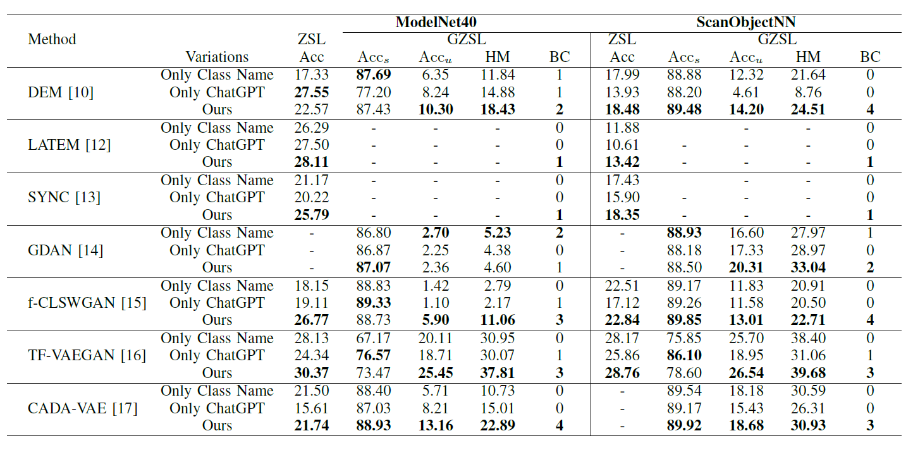

# ChatGPT-guided Semantics for Zero-shot Learning
ChatGPT-guided Semantics for Zero-shot Learning, DICTA 2023.

This paper explores how ChatGPT, a large language model, can enhance class semantics and performance for ZSL tasks. [Read: arXiv](https://arxiv.org/abs/2310.11657)




### Dependencies

Necessary packages can be installed using the ``` environment.yaml``` file.

To generate the description using the Jupyter Notebook, an API Key is required from OpenAI, which can obtained through registration from [here](https://platform.openai.com/docs/api-reference/chat) .


### Datasets

- [Caltech-UCSD Birds-200-2011 (CUB-200-2011)](https://www.vision.caltech.edu/datasets/cub_200_2011/)
- [Animals with Attributes](https://cvml.ista.ac.at/AwA2/)
- [ModelNet](https://modelnet.cs.princeton.edu/)
- [ScanObjectNN](https://hkust-vgd.github.io/scanobjectnn/)


### Model Training

Models are trained following the implementation from the original repository of the papers with slight changes and are listed below.

- [DEM](https://github.com/lzrobots/DeepEmbeddingModel_ZSL)
- [SynC](https://github.com/pujols/Zero-shot-learning-journal)
- [GDAN](https://github.com/stevehuanghe/GDAN)
- [f-CLSWGAN](https://github.com/mkara44/f-clswgan_pytorch)
- [TF-VAEGAN](https://github.com/akshitac8/tfvaegan)
- [CADA_VAE](https://github.com/edgarschnfld/CADA-VAE-PyTorch)


### Results

<p align="center">

Figure: tSNE visualization of features and semantics of 10 classes from ModelNet40 dataset.
</p>

<p align="center">

Figure: Results on 2D datasets.
</p>

<p align="center">

Figure: Results on 3D datasets.
</p>


### Citation

```
@inproceedings{CGS-ZSL,
  title={ChatGPT-guided Semantics for Zero-shot Learning},
  author={Fahimul Hoque Shubho, Townim Faisal Chowdhury, Ali Cheraghian, Morteza Saberi, Nabeel Mohammed, Shafin Rahman},
  booktitle={DICTA},
  year={2023}
}
```

